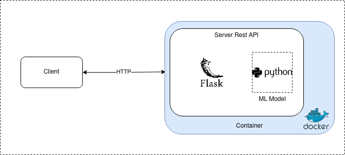

# Prequisites 

It is recommended for a quick start to install VS Code to make use of *Remote Container* 
as a development environment. Most if not all of the dependencies will taken care of. See 
[Developing inside a Container](https://code.visualstudio.com/docs/remote/containers) for 
further details. Alternatively, it will be on the Engineers onus, to ensure the dvelopment 
environment is set up appropriately with *Python 3.10* and the appropriate packages, see 
*requirements.txt*.

Missing from the remote container development environment are the infrastructure 
dependencies i.e. *Docker*, *Terraform CLI*, *AWS CLI*. Please make sure these are installed 
and configure on your local machine. See [Docker](https://docs.docker.com/engine/install/), [Terraform](https://learn.hashicorp.com/tutorials/terraform/install-cli?in=terraform/aws-get-started) and [AWS](https://docs.aws.amazon.com/cli/latest/userguide/getting-started-install.html) for details. 
Therefore, any instructions to execute Terraform, AWS or Docker commands should be down outside 
of the VS Code Remote Container development environment, as I have not installed these dependencies within.

Finally, ensure you have an *AWS account* and the *associated credentials*. 

# Getting Started
Clone the repository set up in challenge 0 and set up an isolated development environment. 


## Challenge 1

### Service Architecture


### Infrastructure Architecture to Host Service


## Challenge 2
From the CLI execute `python benchmark.py` the original script provided with the Endeavour 
ML Eng Challenge. From the CLI execute `python simple_linear_regr.py` the updated 
script addressing the requirements of challenge 2. The engineer should see that the results 
produced indicate a succesfull implementation of Stochastic Gradient Descent. 

If so inclined, please feel free to run the unit tests by executing `pytest`. Alternatively, 
these will be executed, along with linting on a push to the dev branch. 

## Challenge 3
As per challenge 3, the Simple Linear Regression model developed has been implemented as a 
service. The service takes the form of a simple Flask application with Rest APIs, allowing 
the model to be accesible for inference. The two enpoints "stream" and "batch" have been 
replaced with a single endpoint "predict". There is no decernable difference in functionality. 

Note, the filename main.py has been changed to app.py to support Flask. To run locally, 
execute `flask run -p 8000` and then from a second session execute: 

```
curl -X GET http://0.0.0.0:8000/health
curl -X GET http://0.0.0.0:8000/service
curl -X GET http://0.0.0.0:8000/model
curl -X POST http://0.0.0.0:8000/predict -H 'Content-Type: application/json' -d '[[0.001]]
curl -X POST http://0.0.0.0:8000/predict -H 'Content-Type: application/json' -d '[[0.001, 0.05, -0.015]]'
```

Succesfull implementation of the above service, should return the following repsonses:
* ok
* {"name":"endeavour_ml_eng_challenge_service","version":"latest"}
* {"name":"endeavour_ml_eng_challenge_model"}
* [[153.8569578995983]]
* [[153.8569578995983,199.81740527178528,138.84946488010868]]

As, you should see there is no decernable difference in fucntionallity between a request with 
a single record vs multiple records. 

## Challenge 4

## Challenge 5
Challenge 5 requires the build, run and deployment of a container. 

```
docker build -t endv-ml-eng .
docker run -d -p 8000:8000 endv-ml-eng
```

To test the service functionallity locally, after the container is running execute the above curl 
commands from the same space you executed the docker build and run. You should see that the 
response is the same as running the app directly. The container registry choosen to deploy to is 
AWS' Elastic Container Registry and has been deployed via GitHub Actions.

To set up the required infrastructure execute the following from the **infra** folder.

```
terraform init
terraform plan
terraform apply --auto-approve
```

To image will be pushed to the AWS ECR on a push to the main branch, alternatively it can be executed 
manually via GitHub Actions or via the CLI. See the following file **.github/workflow/build_deploy_container**, 
at present the tag being used is *latest*.

```
docker build -t <ecr registry>/<ecr repo>:<image tag> .
docker push <ecr registry>/<ecr repo>:<image tag>
```

## Challenge 6


## Challenge 7

